# TrustxVerify

<p align="center">
  <picture>
    <source media="(prefers-reduced-motion: reduce)" srcset="assets/hero/hero-reduced.svg">
    <source media="(prefers-color-scheme: light)" srcset="assets/hero/hero-light.svg">
    
  </picture>
</p>

<p align="center">
  <picture>
    <source media="(prefers-reduced-motion: reduce)" srcset="assets/hero/computational-dark.svg">
    <source media="(prefers-color-scheme: light)" srcset="assets/hero/computational-light.svg">
    
  </picture>
</p>

TrustxVerify is the trust layer for global commerce.

It scores buyers, sellers, businesses, marketplace accounts, and addresses before transactions happen. Reputation is siloed, fraud is portable, and marketplace operators need a shared legitimacy layer that can follow risk signals across eBay, Facebook Marketplace, Shopify, Craigslist, freight forwarding addresses, and private checkout flows.

## Product Vision

TrustxVerify is building universal legitimacy scoring for people, businesses, marketplace accounts, and addresses. The MVP proves the operating loop: search, report, moderate, score, and connect commerce risk signals.

Current MVP surfaces:

- Premium homepage
- Trust search page
- Fraud report intake page
- Entity detail pages
- Admin moderation dashboard
- Weighted trust scoring engine
- Report status flow: pending, reviewed, dismissed
- Entity connections foundation
- Supabase data layer scoped to schema `trustxverify`

## Tech Stack

- Next.js App Router
- TypeScript
- Tailwind CSS
- Supabase
- pnpm
- Vercel-ready build

## Local Setup

```bash
cd /Users/joshuadavis/startups/trustxverify
pnpm install
pnpm dev
```

Open `http://localhost:3000`.

## Environment

Create `.env.local` from `.env.example` and fill in Supabase values:

```bash
NEXT_PUBLIC_SUPABASE_URL=
NEXT_PUBLIC_SUPABASE_ANON_KEY=
NEXT_PUBLIC_APP_URL=
```

Do not commit real secrets. `.env.local` is intentionally ignored.

## Supabase

Run the SQL in `supabase/trustxverify_schema.sql` against your Supabase project.

Important: all app tables live in schema `trustxverify`, not `public`. The app client uses:

```ts
db: { schema: "trustxverify" }
```

The current MVP RLS policies keep search, report intake, score recomputation, and moderation usable with an anon client. Before production, protect admin moderation and score writes with Supabase Auth, role checks, and service-role server routes.

## Build

```bash
pnpm build
```

Optional checks if scripts exist:

```bash
pnpm lint
pnpm typecheck
```

## Routes

- `/` - product homepage
- `/search` - trust graph search
- `/report` - fraud signal intake
- `/entity/[id]` - entity score and signal detail
- `/admin` - MVP moderation dashboard
- `/api/search` - search API
- `/api/report` - report intake API
- `/api/admin/reports` - MVP moderation API
- `/api/entity-connections` - entity connection API

## Manual Deploy

Do not deploy automatically from recovery work. When ready:

```bash
cd /Users/joshuadavis/startups/trustxverify
pnpm install
pnpm build
vercel --prod
```

## Cleanup

Safe generated artifacts can be removed after a successful build:

```bash
rm -rf node_modules .next .turbo .vercel/cache dist build coverage playwright-report test-results .cache .parcel-cache
find . -name ".DS_Store" -type f -delete
find . -name "*.log" -type f -delete
```

Do not delete `.env.local`, `.env.example`, `pnpm-lock.yaml`, source files, Supabase SQL, docs, or used public assets.

## Return Later

1. Run `pnpm install`.
2. Apply `supabase/trustxverify_schema.sql` if the database is new.
3. Confirm `.env.local` points to the Supabase project.
4. Run `pnpm build`.
5. Continue with authenticated admin, Chrome extension scaffold, and richer connection ingestion.
